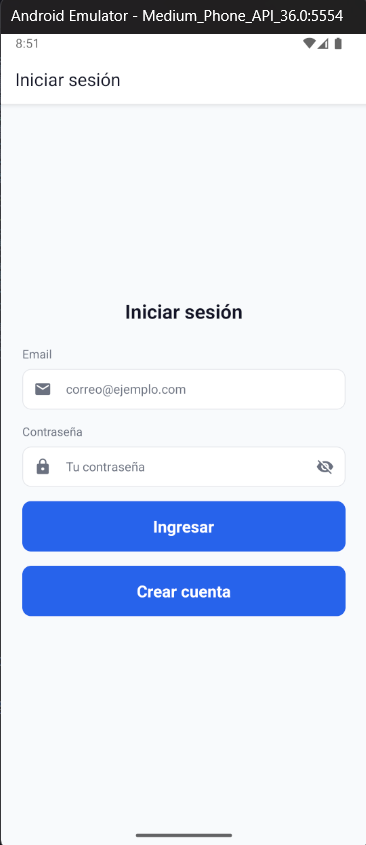
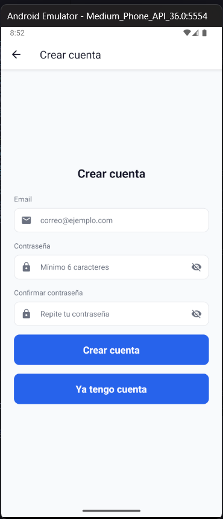
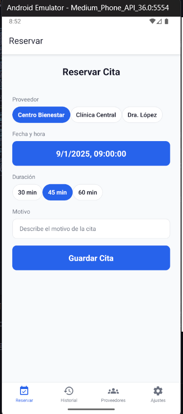
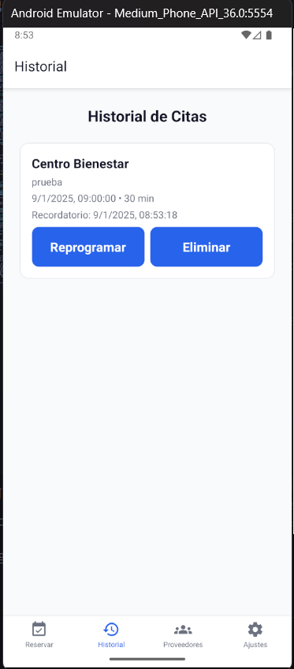
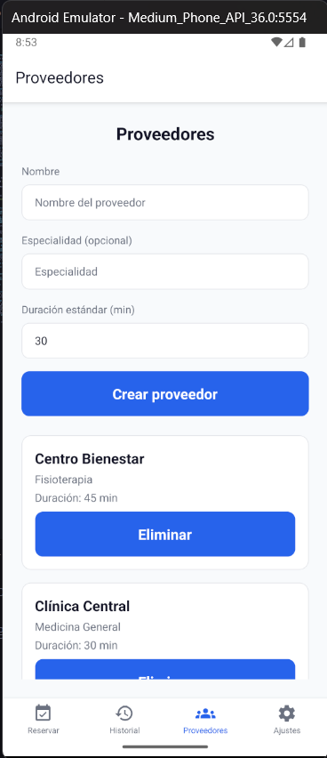
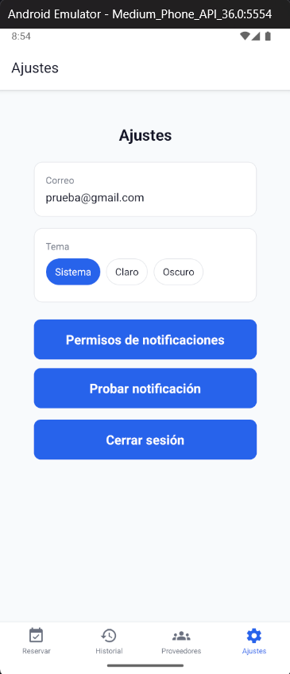
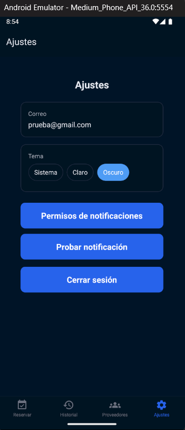

# ReservasCitas — App de Reservas de Citas (Profesional)

<div align="left">

[](https://reactnative.dev)
[](https://www.typescriptlang.org/)
[](https://firebase.google.com/docs)
[](https://notifee.app/react-native/reference)
[](https://reactnavigation.org/)

</div>

## Tabla de Contenidos
- Visión general
- Capturas y dónde guardar imágenes
- Características principales
- Arquitectura y Stack
- Requisitos previos
- Configuración y ejecución
- Scripts útiles
- Permisos y configuración nativa
- Theming y Modo Oscuro
- Notificaciones locales (Notifee)
- Estructura del proyecto
- Buenas prácticas y accesibilidad
- Solución de problemas

## Visión general
ReservasCitas es una app móvil en React Native para gestionar reservas de citas con proveedores. La app está optimizada para ser totalmente responsiva, soporta modo oscuro, notificaciones locales de recordatorio, y sincroniza datos en tiempo real con Firebase.

## Capturas








## Características principales
- Responsividad completa con `SafeAreaView`, `KeyboardAvoidingView`, `ScrollView`/`FlatList`.
- Modo oscuro y tema dinámico integrados con React Navigation.
- Selector de fecha/hora adaptado por plataforma (iOS inline, Android en 2 pasos).
- Notificaciones locales con canal dedicado y permisos en Android 13+.
- Estados vacíos con CTA y pull-to-refresh en listas clave.
- Sincronización de proveedores entre pantallas y recarga al enfocar.
- Confirmación de éxito al reservar (modal animado + navegación automática).

## Arquitectura y Stack
- React Native 0.81.x + TypeScript
- Navegación: `@react-navigation/native`, `@react-navigation/native-stack`, `react-native-screens`
- UI/Temas: sistema propio en `src/theme/` (colores, tipografía, ThemeProvider)
- Picker de fecha/hora: `@react-native-community/datetimepicker`
- Notificaciones: `@notifee/react-native`
- Backend: Firebase (`@react-native-firebase/auth`, `@react-native-firebase/firestore`)
- Formularios/validación: `react-hook-form` y `yup` (si aplica)

## Requisitos previos
- Node.js 18+
- Java JDK 17 y Android SDK (Android 13+ recomendado)
- Xcode 15+ (para iOS, en macOS)
- CocoaPods (`sudo gem install cocoapods`) en macOS
- Cuenta de Firebase y archivos de configuración:
  - Android: `android/app/google-services.json`
  - iOS: `ios/GoogleService-Info.plist`

## Configuración y ejecución
1) Instalar dependencias JS:
```bash
npm install
# o
yarn
```

2) iOS (solo macOS):
```bash
cd ios && pod install && cd ..
```

3) Ejecutar Metro:
```bash
npm start
```

4) Ejecutar en dispositivo/emulador:
```bash
npm run android
# o
npm run ios
```

## Scripts útiles
- `npm start`: inicia Metro
- `npm run android`: compila e instala en Android
- `npm run ios`: compila e instala en iOS (simulador por defecto)

## Permisos y configuración nativa
Android (`android/app/src/main/AndroidManifest.xml`):
- `POST_NOTIFICATIONS` para Android 13+
- `RECEIVE_BOOT_COMPLETED` si deseas reprogramar recordatorios tras reinicio

Canal de notificaciones: se crea al iniciar la app (`reminders`).

iOS:
- Revisa capacidades de notificaciones y permisos en Xcode si activas notificaciones push remotas (para locales, basta con Notifee configurado).

Firebase:
- Coloca `google-services.json` y `GoogleService-Info.plist` en rutas indicadas.
- Android: asegura `classpath 'com.google.gms:google-services:...` y `apply plugin: 'com.google.gms.google-services'` en `android/app/build.gradle`.

## Theming y Modo Oscuro
- Paletas en `src/theme/colors.ts` con `lightColors` y `darkColors`.
- `ThemeProvider` expone `useTheme()` con `colors` y `isDark`.
- `NavigationContainer` recibe un tema derivado para headers, tabs y fondo.

## Notificaciones locales (Notifee)
- Permisos solicitados al iniciar en `App.tsx`.
- Botón de prueba en `Settings` para validar.
- Al reservar se programa un recordatorio; si la cita es muy cercana, se notifica pronto.

## Estructura del proyecto (resumen)
```
ReservasCitas/
├─ android/
├─ ios/
├─ src/
│  ├─ components/
│  ├─ lib/            # helpers (toast, notifications, date)
│  ├─ screens/        # Booking, Providers, History, Settings, etc.
│  ├─ services/       # providersService, appointmentsService
│  └─ theme/          # colors, typography, ThemeProvider
├─ docs/
│  └─ images/         # capturas para el README
└─ App.tsx
```

## Buenas prácticas y accesibilidad
- Botones con targets cómodos y contraste suficiente.
- Soporte de teclado con `KeyboardAvoidingView` y scroll asegurado.
- Estados vacíos claros con CTA.

## Solución de problemas
- Android 13+ no muestra notificaciones:
  - Verifica permiso `POST_NOTIFICATIONS` y solicita permisos desde Ajustes.
- El picker de Android se comporta raro:
  - Se usa flujo en dos pasos (fecha → hora) para mayor estabilidad.
- Spinners que no se detienen:
  - Asegurado `finally` para `refreshing/saving` y timeouts en notificaciones.
- iOS CocoaPods:
  - Ejecuta `pod install` dentro de `ios/` tras cambiar dependencias nativas.

---

¿Dudas? Crea un issue o abre una PR. ¡Gracias por usar ReservasCitas!
